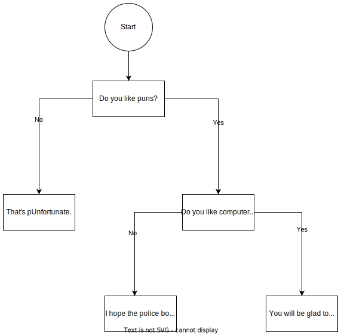

## Variables and constants

### What data types have we seen so far?

int, char, double

### How do we declare a variable?

* Format: `data_type variable_name;`
* `int integer`
* `double floating`
* `char command`

### How do we declare a constant

`#define MIN 100`

### How and why do we initialise a variable?

`int value = 100;`

`double floatingpoints = 100.000`

`char command = 'c'`

### How do we print the value of a variable?

Printf("%d", value);

printf("%lf", floatingpoints);

printf("%c", command);

### How to spot the style issue

`1091 style <filename>`

## Calculating values in programs

### Arithmetic

`+` => 1 + 1 = 2
`-` => 2 - 1 = 1
`*` => 2 * 2 = 4
`/` => 5 / 2 = 2
`%` => 5 % 2 = 1

* what is the difference between `/` and `%` ?

### Extra arithmetic operators

`++` => val ++ => val = val + 1

`--` => val -- => val = val - 1

`+=` => val += 2 => val = val + 2

`-=` => val -= 2 => val = val - 2

`*=`

`/=`

.....

### Logic

`&&` => and `false && true`=> false `true && true`=> true

`||` => or `if(false || true)`=> true `false || false`=> false

`!` => not `!false` => true `!true` => false

### Comparison

`!=` `if (5 != 4)` => true

`==` `if  (5 == 5) `=> true

`> >=` `if (5 >= 4)`=> true

`< <=`if (5 <= 4) => false

## Werid data types and arithmetic

`int` => 4 bytes 

`double` => 8 bytes

`char` => 1 byte

* What is the data type of the result when we divide an integer by another integer?
  * Integer
* What is the data type(s) of the result when we add an integer to a char?
  * all the chars are integers but not all integers are chars
  * open ascii table in Tigeter VNC: `ascii -d`
  

## Diagramming

### Features of a flow chart

* Circle: start of flowe chart
* Boxes: questions/decisions
* Arrows: answers to the questions
  * Direct us to the next question/decision

### What is a pseudocode

Just focus on the line's purpose